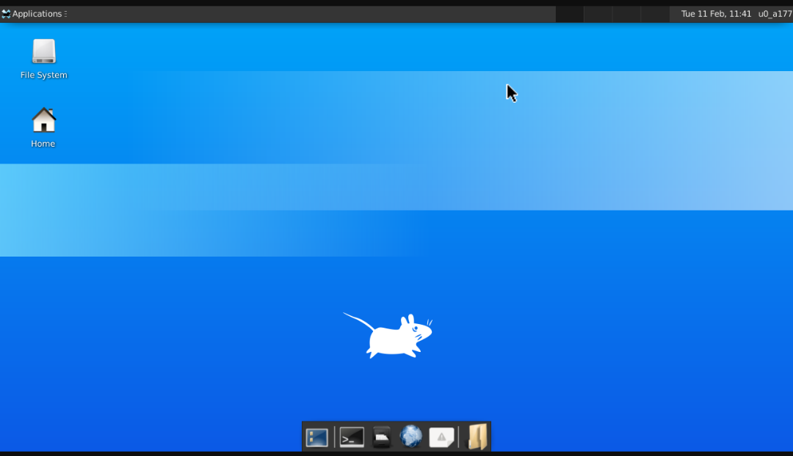

# Termux-GUI

Use Termux in GUI mode using XFCE environment

A simple python script to install XFCE environment in Termux

## Installation
1) apt install python3

2) git clone https://github.com/HackWeiser360/TermuxGUI

3) cd TermuxGUI

4) pip3 install -r requirements.txt

5) python3 gui.py

## Download the VNC Viewer app
VNC Viewer - [Download](https://play.google.com/store/apps/details?id=com.realvnc.viewer.android&hl=en_IN)

## How to start Termux-GUI

a) Run 'vncserver' command

b) Add new password for vnc

c) You will get IP Address like this -

      localhost:<session_number>

      e.g. localhost:1
   
d) After above step,type following command -

      DISPLAY=:1 startxfce4 &

   Here,1 is a session number.
      
e) Install VNC Viewer on your phone

f) Add IP Address which you got at Step 3

      e.g. localhost:1
    
g) Add name

h) Click on Connect

i) Enter VNC password which you used at Step 2

## Exit GUI

Enter following command before exit -

            vncserver -kill :<session_number>
            e.g. vncserver -kill :1
